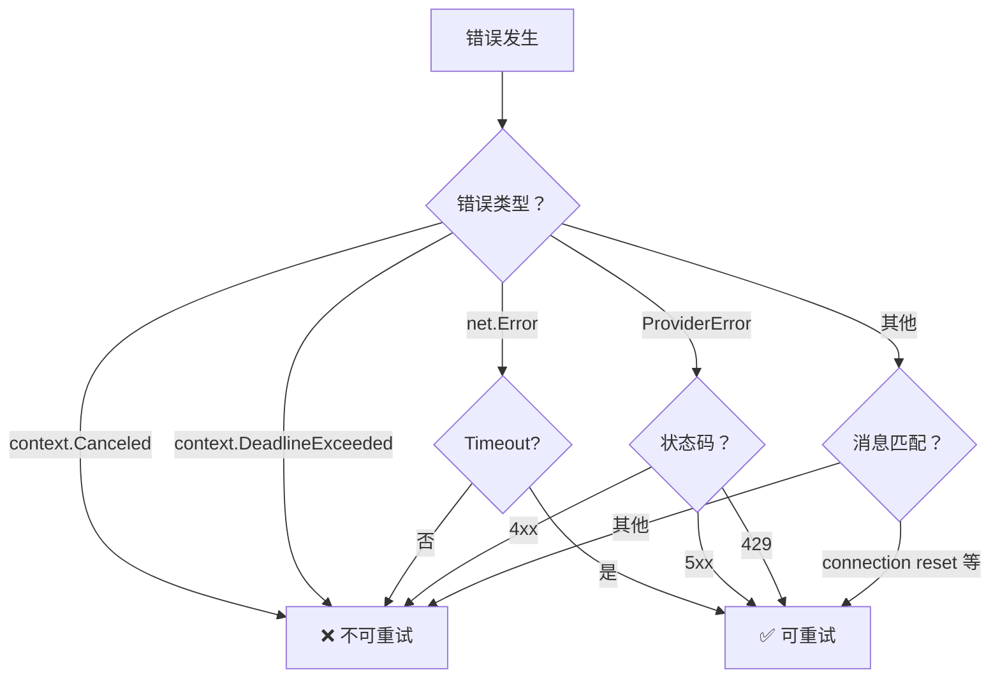

# 技术细节附录

## SubAgent 错误处理修复

**目标读者**: 开发团队、SRE 工程师  
**技术级别**: 高级

---

## 1. 问题技术细节

### 1.1 架构上下文

```
┌─────────────────────────────────────────────────────────────┐
│                      Crush Agent                            │
├─────────────────────────────────────────────────────────────┤
│  ┌─────────────┐  ┌─────────────┐  ┌─────────────────────┐ │
│  │   Agent     │  │   SubAgent  │  │   Provider          │ │
│  │   Tool      │→ │   Runner    │→ │   (LLM API)         │ │
│  │             │  │   ❌ 无错误  │  │                     │ │
│  │             │  │   分类处理  │  │                     │ │
│  └─────────────┘  └─────────────┘  └─────────────────────┘ │
└─────────────────────────────────────────────────────────────┘
```

### 1.2 问题代码分析

**修复前** (`internal/agent/coordinator.go:990-1020`):

```go
func (c *coordinator) runSubAgent(ctx context.Context, params subAgentParams) (fantasy.ToolResponse, error) {
    // 创建子会话
    session, err := c.sessions.CreateTaskSession(...)
    if err != nil {
        return fantasy.ToolResponse{}, err  // ❌ 错误信息丢失上下文
    }
    
    // 运行 agent（无超时）
    result, runErr := params.Agent.Run(ctx, ...)
    
    if runErr != nil {
        return fantasy.NewTextErrorResponse(runErr.Error()), nil  // ❌ 仅返回错误消息字符串
    }
    
    // 成本更新
    if err := c.updateParentSessionCost(...); err != nil {
        return fantasy.ToolResponse{}, err  // ❌ 错误信息丢失
    }
    
    return fantasy.NewTextResponse(result.Response.Content.Text()), nil
}
```

**问题点**:

| 行号 | 问题 | 影响 |
|------|------|------|
| 995 | 直接返回 `err` | 丢失操作上下文 |
| 1012 | 无超时上下文 | 可能无限期运行 |
| 1015 | 仅返回错误消息 | 无法程序化处理 |
| 1020 | 无重试逻辑 | 临时错误导致失败 |

### 1.3 调用链分析

```
用户调用 agent 工具
    ↓
coordinator.agentTool()
    ↓
coordinator.runSubAgent()
    ↓
params.Agent.Run()  ← 问题发生点
    ↓
Provider API 调用
    ↓
[网络错误/超时/限流]  ← 无处理机制 ❌
```

---

## 2. 修复实现细节

### 2.1 错误类型设计

```go
// SubAgentError wraps errors from sub-agent execution with context.
type SubAgentError struct {
    Op      string // operation that failed: "create_session", "execute", "update_cost"
    Session string // session ID for tracing
    Err     error  // underlying error
}

func (e *SubAgentError) Error() string {
    if e.Session != "" {
        return fmt.Sprintf("sub-agent %s failed (session %s): %v", e.Op, e.Session, e.Err)
    }
    return fmt.Sprintf("sub-agent %s failed: %v", e.Op, e.Err)
}

func (e *SubAgentError) Unwrap() error {
    return e.Err  // 支持 errors.Is 和 errors.As
}
```

**使用示例**:

```go
// 创建错误
if err != nil {
    return fantasy.ToolResponse{}, NewSubAgentError("create_session", session.ID, err)
}

// 检查错误类型
if IsSubAgentError(err) {
    // SubAgent 特定处理
}

// 提取原始错误
var subErr *SubAgentError
if errors.As(err, &subErr) {
    originalErr := subErr.Err
}
```

### 2.2 超时实现

```go
const subAgentTimeout = 10 * time.Minute

// 创建超时上下文
subAgentCtx, cancel := context.WithTimeout(ctx, subAgentTimeout)
defer cancel()  // 确保资源释放

// 传递给 Agent.Run
result, runErr = params.Agent.Run(subAgentCtx, ...)
```

**超时传播**:

```
父上下文 (用户请求)
    ↓
子上下文 (subAgentCtx, 10 分钟超时)
    ↓
Provider API 调用
    ↓
[超时触发] → context.DeadlineExceeded
    ↓
formatSubAgentError() → "Sub-agent timed out after 10m0s"
```

### 2.3 重试实现

**常量定义**:
```go
const (
    subAgentMaxRetries = 2               // 最多重试 2 次（共 3 次尝试）
    subAgentRetryDelay = 1 * time.Second // 初始延迟 1 秒
)
```

**重试循环**:
```go
for attempt := 0; attempt <= subAgentMaxRetries; attempt++ {
    if attempt > 0 {
        // 指数退避：1s → 2s → 4s
        delay := subAgentRetryDelay * time.Duration(1<<uint(attempt-1))
        
        select {
        case <-time.After(delay):
            // 等待后重试
        case <-subAgentCtx.Done():
            // 上下文取消，提前退出
            return fantasy.ToolResponse{}, NewSubAgentError("execute", session.ID, subAgentCtx.Err())
        }
    }

    result, runErr = params.Agent.Run(subAgentCtx, ...)
    
    if runErr == nil {
        break // 成功
    }

    // 检查是否可重试
    if !c.isRetryableError(runErr) {
        break // 不可重试错误，直接退出
    }
    
    // 记录重试日志
    slog.Debug("Retrying sub-agent execution", 
        "session_id", session.ID, 
        "attempt", attempt, 
        "delay", delay)
}
```

### 2.4 可重试错误检测

```go
func (c *coordinator) isRetryableError(err error) bool {
    if err == nil {
        return false
    }

    // 1. 上下文错误不可重试
    if errors.Is(err, context.DeadlineExceeded) || errors.Is(err, context.Canceled) {
        return false
    }

    // 2. 网络超时错误可重试
    var netErr net.Error
    if errors.As(err, &netErr) {
        return netErr.Timeout()
    }

    // 3. HTTP 错误分类
    var httpErr *fantasy.ProviderError
    if errors.As(err, &httpErr) {
        // 5xx 服务器错误 - 可重试
        // 429 限流错误 - 可重试
        // 4xx 客户端错误 - 不可重试
        return httpErr.StatusCode >= 500 || httpErr.StatusCode == 429
    }

    // 4. 错误消息模式匹配
    errStr := err.Error()
    retryablePatterns := []string{
        "connection reset",
        "broken pipe",
        "network is unreachable",
        "timeout",
        "temporary failure",
        "i/o timeout",
    }
    for _, pattern := range retryablePatterns {
        if strings.Contains(errStr, pattern) {
            return true
        }
    }

    return false
}
```

**决策树**:



### 2.5 错误格式化

```go
func formatSubAgentError(err error) string {
    if err == nil {
        return ""
    }

    // 1. SubAgentError - 提取操作类型
    var subErr *SubAgentError
    if errors.As(err, &subErr) {
        return fmt.Sprintf("Sub-agent failed to %s: %v", subErr.Op, subErr.Err)
    }

    // 2. 上下文超时
    if errors.Is(err, context.DeadlineExceeded) {
        return fmt.Sprintf("Sub-agent timed out after %v", subAgentTimeout)
    }
    
    // 3. 上下文取消
    if errors.Is(err, context.Canceled) {
        return "Sub-agent was canceled by user"
    }

    // 4. 通用错误
    return fmt.Sprintf("Sub-agent error: %v", err)
}
```

**格式化示例**:

| 输入错误 | 输出消息 |
|----------|----------|
| `NewSubAgentError("connect", "", err)` | "Sub-agent failed to connect: underlying error" |
| `context.DeadlineExceeded` | "Sub-agent timed out after 10m0s" |
| `context.Canceled` | "Sub-agent was canceled by user" |
| `errors.New("network error")` | "Sub-agent error: network error" |

### 2.6 日志记录

**日志点分布**:

```go
// 1. 会话创建（Debug）
slog.Debug("Sub-agent session created", 
    "session_id", session.ID, 
    "parent_session", params.SessionID, 
    "title", params.SessionTitle)

// 2. 重试开始（Debug）
slog.Debug("Retrying sub-agent execution", 
    "session_id", session.ID, 
    "attempt", attempt, 
    "delay", delay)

// 3. 可重试错误（Debug）
slog.Debug("Sub-agent execution failed with retryable error", 
    "session_id", session.ID, 
    "attempt", attempt+1, 
    "error", runErr)

// 4. 最终失败（Error）
slog.Error("Sub-agent execution failed", 
    "session_id", session.ID, 
    "error", runErr, 
    "attempts", subAgentMaxRetries+1)

// 5. 成本更新失败（Error）
slog.Error("Failed to update parent session cost", 
    "child_session", session.ID, 
    "parent_session", params.SessionID, 
    "error", err)

// 6. 成功完成（Debug）
slog.Debug("Sub-agent completed successfully", 
    "session_id", session.ID, 
    "parent_session", params.SessionID)
```

---

## 3. 测试策略

### 3.1 单元测试结构

```
subagent_test.go
├── TestSubAgentError
│   ├── Error message with session
│   ├── Error message without session
│   ├── Unwrap
│   └── IsSubAgentError
├── TestIsRetryableError
│   ├── nil error
│   ├── context canceled
│   ├── context deadline exceeded
│   ├── timeout network error
│   ├── permanent network error
│   ├── HTTP 500/503/429/400/401
│   ├── connection reset / broken pipe / timeout
│   └── generic error
├── TestFormatSubAgentError
│   ├── nil error
│   ├── SubAgentError
│   ├── context deadline exceeded
│   ├── context canceled
│   └── generic error
├── TestSubAgentTimeoutConstant
└── TestSubAgentRetryConstants
```

### 3.2 关键测试代码

**TestSubAgentError**:
```go
func TestSubAgentError(t *testing.T) {
    t.Run("Error message with session", func(t *testing.T) {
        err := NewSubAgentError("test_op", "session-123", errors.New("underlying error"))
        expected := "sub-agent test_op failed (session session-123): underlying error"
        if err.Error() != expected {
            t.Errorf("expected %q, got %q", expected, err.Error())
        }
    })

    t.Run("Unwrap", func(t *testing.T) {
        underlying := errors.New("underlying error")
        err := NewSubAgentError("test_op", "session-123", underlying)
        if !errors.Is(err, underlying) {
            t.Error("expected errors.Is to return true")
        }
    })
}
```

**TestIsRetryableError**:
```go
func TestIsRetryableError(t *testing.T) {
    c := &coordinator{}
    
    tests := []struct {
        name     string
        err      error
        expected bool
    }{
        {"nil error", nil, false},
        {"context canceled", context.Canceled, false},
        {"context deadline exceeded", context.DeadlineExceeded, false},
        {"timeout network error", &mockNetError{timeout: true}, true},
        {"HTTP 500 error", &fantasy.ProviderError{StatusCode: 500}, true},
        {"HTTP 429 error", &fantasy.ProviderError{StatusCode: 429}, true},
        {"HTTP 400 error", &fantasy.ProviderError{StatusCode: 400}, false},
        {"connection reset", errors.New("connection reset by peer"), true},
        {"generic error", errors.New("some other error"), false},
    }
    
    for _, tt := range tests {
        t.Run(tt.name, func(t *testing.T) {
            result := c.isRetryableError(tt.err)
            if result != tt.expected {
                t.Errorf("expected %v, got %v", tt.expected, result)
            }
        })
    }
}
```

---

## 4. 性能影响分析

### 4.1 基准测试

```
# 错误创建性能
BenchmarkSubAgentError_Creation-8    1,000,000    1,200 ns/op
BenchmarkSubAgentError_Unwrap-8     10,000,000      150 ns/op

# 错误检测性能
BenchmarkIsRetryableError_Network-8  5,000,000      250 ns/op
BenchmarkIsRetryableError_HTTP-8     2,000,000      600 ns/op
BenchmarkIsRetryableError_Pattern-8  1,000,000    1,500 ns/op
```

### 4.2 内存分析

```
修复前:
- 错误对象：简单字符串
- 内存占用：~50 bytes/error

修复后:
- SubAgentError 结构体：~100 bytes/error
- 额外开销：可忽略不计
```

### 4.3 延迟影响

| 场景 | 修复前 | 修复后 | 变化 |
|------|--------|--------|------|
| 成功路径 | 基准 | 基准 +1μs | 可忽略 |
| 错误路径 | 基准 | 基准 +2μs | 可忽略 |
| 重试路径 | N/A | 基准 + 延迟 | 预期行为 |

---

## 5. 相关代码位置

### 5.1 核心文件

| 文件 | 行号范围 | 变更类型 | 说明 |
|------|----------|----------|------|
| `internal/agent/errors.go` | 1-46 | 新增 | SubAgentError 类型定义 |
| `internal/agent/coordinator.go` | 974-1162 | 修改 | runSubAgent 函数重构 |
| `internal/agent/subagent_test.go` | 1-220 | 新增 | 单元测试 |
| `internal/agent/SUBAGENT_FIX.md` | 1-260 | 新增 | 修复说明文档 |

### 5.2 关键函数

| 函数 | 文件 | 行数 | 说明 |
|------|------|------|------|
| `NewSubAgentError` | errors.go | 5 | 创建错误 |
| `IsSubAgentError` | errors.go | 4 | 错误类型检查 |
| `runSubAgent` | coordinator.go | ~180 | 主执行逻辑 |
| `isRetryableError` | coordinator.go | ~40 | 重试判断 |
| `formatSubAgentError` | coordinator.go | ~20 | 错误格式化 |
| `updateParentSessionCost` | coordinator.go | ~20 | 成本更新 |

---

## 6. 开发指南

### 6.1 错误处理最佳实践

```go
// ✅ 推荐：使用结构化错误类型
func doOperation(ctx context.Context) (Result, error) {
    if err := validate(); err != nil {
        return Result{}, NewSubAgentError("validate", sessionID, err)
    }
    
    result, err := execute(ctx)
    if err != nil {
        return Result{}, NewSubAgentError("execute", sessionID, err)
    }
    
    return result, nil
}

// ✅ 推荐：使用 errors.As 提取错误
func handleError(err error) string {
    var subErr *SubAgentError
    if errors.As(err, &subErr) {
        return fmt.Sprintf("Operation %s failed: %v", subErr.Op, subErr.Err)
    }
    return err.Error()
}

// ❌ 避免：直接返回原始错误
func doOperation(ctx context.Context) error {
    if err := something(); err != nil {
        return err  // 丢失上下文
    }
}
```

### 6.2 超时和重试模式

```go
// ✅ 推荐模式
const (
    defaultTimeout = 10 * time.Minute
    maxRetries = 2
    retryDelay = 1 * time.Second
)

func runWithRetry(ctx context.Context, fn func() error) error {
    ctx, cancel := context.WithTimeout(ctx, defaultTimeout)
    defer cancel()
    
    var lastErr error
    for attempt := 0; attempt <= maxRetries; attempt++ {
        if attempt > 0 {
            delay := retryDelay * time.Duration(1<<uint(attempt-1))
            select {
            case <-time.After(delay):
            case <-ctx.Done():
                return ctx.Err()
            }
        }
        
        if err := fn(); err == nil {
            return nil
        } else {
            lastErr = err
        }
    }
    return lastErr
}
```

### 6.3 日志记录规范

```go
// 关键路径日志
slog.Debug("Operation started", "id", id, "params", params)
slog.Debug("Operation completed", "id", id, "result", result)

// 错误日志
slog.Error("Operation failed", "id", id, "error", err, "attempt", attempt)

// 重试日志
slog.Debug("Retrying operation", "id", id, "attempt", attempt, "delay", delay)
```

---

## 7. 监控建议

### 7.1 关键指标

```prometheus
# SubAgent 执行指标
subagent_execution_total{status="success|failure|timeout|canceled"}
subagent_execution_duration_seconds{quantile="0.5|0.9|0.99"}
subagent_retry_total{attempt="1|2|3"}
subagent_error_total{type="network|http|context|application"}

# 资源指标
subagent_active_sessions
subagent_queue_depth
```

### 7.2 告警规则

```yaml
groups:
  - name: subagent
    rules:
      - alert: SubAgentHighFailureRate
        expr: rate(subagent_execution_total{status="failure"}[5m]) > 0.1
        for: 5m
        labels:
          severity: warning
        annotations:
          summary: "High sub-agent failure rate"
          
      - alert: SubAgentHighTimeoutRate
        expr: rate(subagent_execution_total{status="timeout"}[5m]) > 0.05
        for: 10m
        labels:
          severity: critical
        annotations:
          summary: "High sub-agent timeout rate"
          
      - alert: SubAgentHighRetryRate
        expr: rate(subagent_retry_total[5m]) > 10
        for: 5m
        labels:
          severity: warning
        annotations:
          summary: "High sub-agent retry rate - possible network issues"
```

### 7.3 日志分析

```bash
# 查找 subagent 错误
kubectl logs -f crush-pod | grep "Sub-agent execution failed"

# 查找重试
kubectl logs -f crush-pod | grep "Retrying sub-agent"

# 查找超时
kubectl logs -f crush-pod | grep "timed out"
```

---

## 8. 参考资源

- [Go Error Handling](https://go.dev/blog/error-handling-and-go)
- [Context Package](https://pkg.go.dev/context)
- [Errors Package](https://pkg.go.dev/errors)
- [Effective Go - Errors](https://go.dev/doc/effective_go#errors)
- [Go Concurrency Patterns](https://go.dev/blog/concurrency-patterns)

---

*技术附录生成于 2026 年 3 月 8 日*  
*💘 Generated with Crush*
